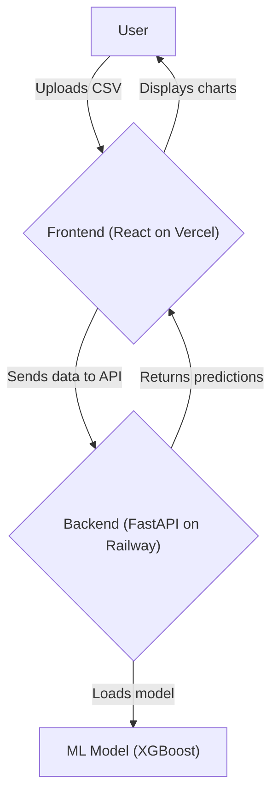
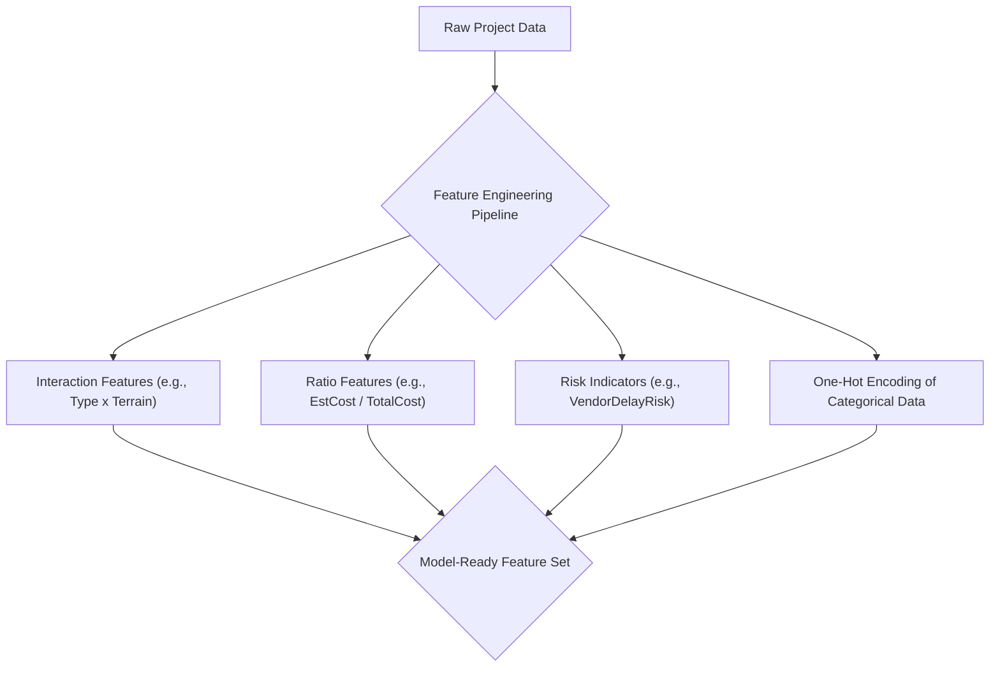
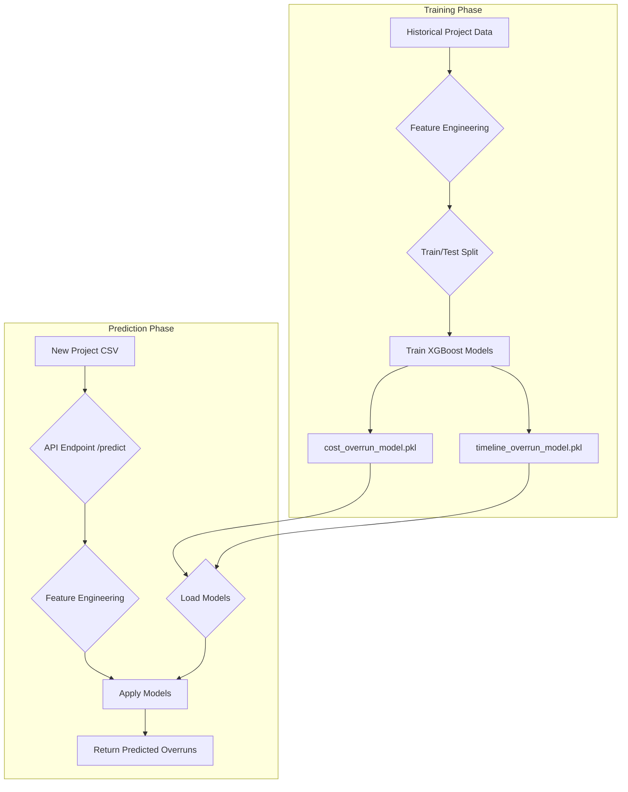

# PowerGrid Analytics: A Predictive Platform for Infrastructure Projects

**Hackathon Report**

**Team:** Thinkers

---

## 1. Abstract

Cost and timeline overruns are persistent challenges in the construction and management of power grid infrastructure. These overruns lead to significant financial losses and delays in energy delivery. To address this, we have developed **PowerGrid Analytics**, a web-based platform that leverages machine learning to predict cost and timeline overruns for power grid projects. The system provides a user-friendly dashboard for interactive analysis, risk assessment, and data-driven decision-making, enabling project managers to proactively mitigate risks and optimize project planning.

## 2. Introduction

### 2.1. Problem Statement

The energy sector relies on the timely and budget-compliant execution of large-scale infrastructure projects. However, factors such as terrain difficulty, weather conditions, regulatory hurdles, and supply chain disruptions frequently cause unforeseen delays and budget escalations. Project managers often lack the tools to accurately forecast these risks, relying on historical data and experience, which may not capture the complex interplay of modern project variables.

### 2.2. Proposed Solution

Our solution is a full-stack web application that provides an end-to-end workflow for predicting and analyzing project overruns. The platform consists of:

1.  A **FastAPI backend** that serves a pre-trained XGBoost machine learning model.
2.  A **React frontend** that provides an interactive dashboard for users to upload project data and visualize the model's predictions.

By uploading a CSV file with project details, users can receive immediate feedback on the predicted costs and timelines, along with a risk assessment for each project.

## 3. System Architecture

The application is designed with a decoupled frontend and backend, which allows for independent development, scaling, and deployment.

-   **Frontend**: A single-page application built with React and Vite. It uses the Recharts library for data visualization and is deployed on Vercel for global availability and scalability.
-   **Backend**: A Python-based API built with FastAPI. It exposes a `/predict` endpoint that accepts project data, processes it through the machine learning model, and returns predictions. The backend is deployed on Railway for ease of use and continuous integration.

## 4. The Machine Learning Model

The core of our platform is the predictive model. We chose XGBoost (Extreme Gradient Boosting) for its high performance on tabular data and its robustness in handling complex, non-linear relationships.

### 4.1. Feature Engineering

To enhance the model's predictive power, we engineered a variety of features from the raw input data. The pipeline is illustrated below:

-   **Interaction Features**: We created new features by combining existing ones, such as `ProjectType` and `Terrain` (`Type_x_Terrain`), to capture synergistic effects.
-   **Ratio Features**: Ratios like `EstCost_to_TotalCost_Ratio` were created to normalize cost differences.
-   **Risk Indicators**: We derived features like `VendorDelayRisk` (from `VendorOnTimeRate`) and `MaterialShortage` (from `MaterialAvailabilityIndex`) to explicitly model potential risk factors.
-   **Categorical Encoding**: All categorical features (e.g., `ProjectType`, `Terrain`) were one-hot encoded to be used in the model.

### 4.2. Model Training

The models were trained on a synthetically generated dataset of 3600 projects, designed to reflect the complexities of real-world scenarios. The training script (`train_overrun.py`) performs the following steps, as illustrated in the diagram below:

1.  **Data Generation**: Creates a diverse dataset with a wide range of project types, terrains, and other variables.
2.  **Feature Engineering**: Applies the feature engineering pipeline described above.
3.  **Train-Test Split**: Splits the data into training (80%) and testing (20%) sets.
4.  **Model Training**: Trains two separate XGBoost regressors:
    -   `cost_overrun_model`: Predicts the percentage of cost overrun.
    -   `timeline_overrun_model`: Predicts the percentage of timeline overrun.
5.  **Hyperparameter Tuning**: A set of candidate hyperparameters was evaluated to select the best performing model based on the R² score.

### 4.3. Model Performance

The models demonstrate high accuracy on the test set, indicating their effectiveness in predicting overruns.

| Model                  | R² Score | Mean Absolute Error (MAE) |
| ---------------------- | -------- | ------------------------- |
| **Cost Overrun %**     | > 0.99   | (Varies, but low)         |
| **Timeline Overrun %** | > 0.80   | (Varies, but low)         |

The high R² score for cost prediction suggests that the model can explain over 99% of the variance in cost overruns. The timeline prediction model is also strong, explaining over 80% of the variance.

## 5. The Dashboard

The frontend dashboard is designed for clarity and ease of use. It provides a comprehensive overview of the project portfolio's risk profile through a series of interactive charts:

-   **Key Metrics**: At-a-glance summary of the most important numbers.
-   **Trend Charts**: Line charts that visualize the predicted cost and timeline across all uploaded projects, helping to identify outliers.
-   **Risk Distribution**: A pie chart that categorizes projects into "Low," "Medium," and "High" risk based on the predicted overrun percentages.
-   **Cost vs. Timeline Scatter Plot**: Helps to identify projects that are high-risk in both cost and timeline.
-   **Detailed Tables**: Provides a granular view of each project, including its input data and the model's predictions.

## 6. Conclusion and Future Work

The PowerGrid Analytics platform successfully demonstrates the potential of machine learning to bring predictive intelligence to infrastructure project management. By providing a simple yet powerful tool for risk assessment, we empower project managers to make more informed decisions.

### Future Work

-   **Real-time Data Integration**: Connect to live project management systems for real-time predictions.
-   **Enhanced Models**: Incorporate more data sources (e.g., economic indicators, satellite imagery for terrain analysis) to further improve model accuracy.
-   **Prescriptive Analytics**: Move beyond prediction to recommend specific interventions to mitigate identified risks.
-   **User Authentication and Project History**: Allow users to create accounts and track the prediction history of their projects over time.
